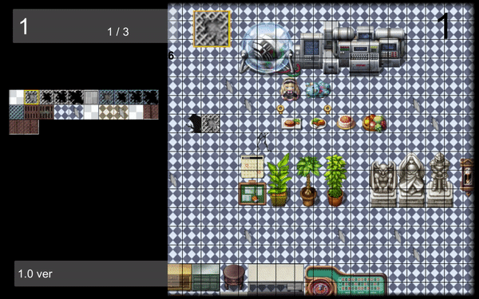
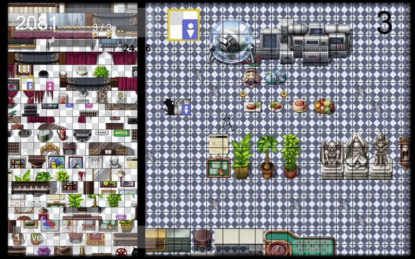
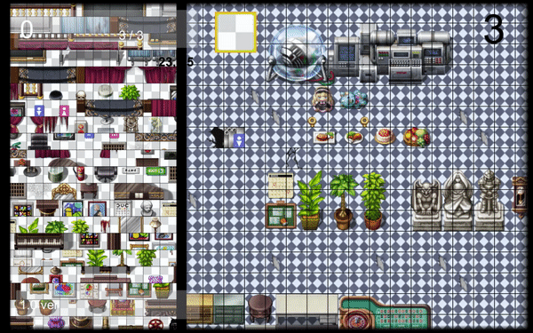
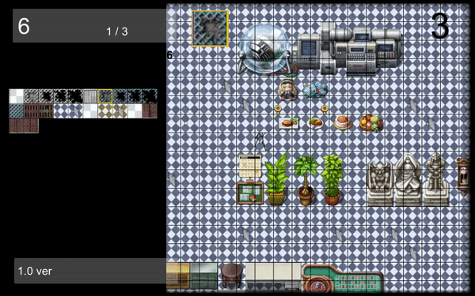
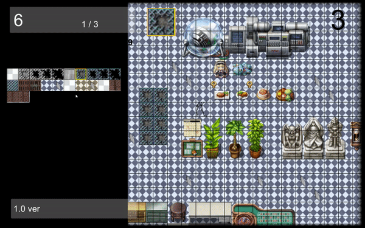
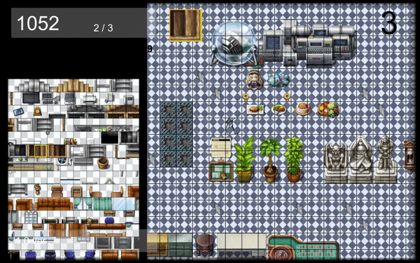
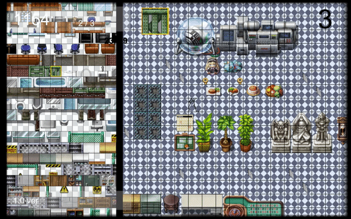
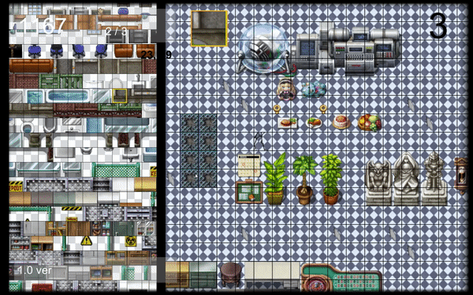
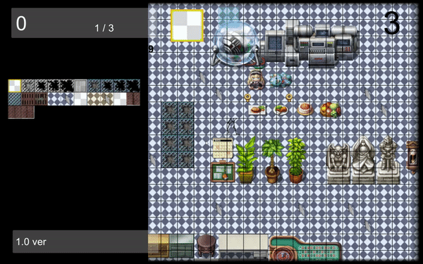

  
  

 

<h3 align="center">ASTAR ALGORITHM SIMULATOR</h3>

---

 
      Tile Map Editor made with Unity

## 📝 Table of Contents

- [Getting Started](#getting_started)
- [Acknowledgments](#acknowledgement)

## 🏁 Getting Started 

### Tutorial

1. **타일 맵 에디터를 실행하려며 이 깃을 클론받고, 아래의 파일을 실행하세요.**

    `YOUR_CLONED_GIT_DIRECTORY/tile map editor.exe`

1. **조작방법은 다음과 같습니다.**

    #### `F1`: Help On/Off
        
        도움말 메시지를 볼 수 있습니다.

    #### `레이어 선택`: num1, num2, num3, num4, num5, num6

        레이어를 선택 할 수 있습니다. 숫자가 클 수록 앞에 위치합니다.

    

    #### `지우개 선택`: R key

        설치한 타일 맵을 지울 수 있는 지우개를 선택합니다. 설정된 레이어에 따라 다르게 동작합니다.

    

    #### `이동`: 방향키

        맵에서 이동 할 수 있습니다.

    

    #### `그리기`: Left Mouse Click | Drag

        타일을 선택 한 후 클릭 또는 드래그로 타일을 맵에 설치 할 수 있습니다.

    

    #### `타일 선택`: Mouse Wheel Click

        왼쪽 타일 선택 네비게이션에서 휠 클릭으로 타일을 선택 할 수 있습니다.

    

    #### `타일 선택 이동`: W, A, S, D

        W, A, S, D 키로 타일 네비게이션에서 타일을 이동하며 선택 할 수 있습니다.

    

    #### `빠르게 타일 선택 이동`: Shift + W, A, S, D

        Shift 키를 누르면 빠르게 이동하며 선택 할 수 있습니다.

    

    #### `타일 세트 변경`: Q(앞으로), E(뒤로)

        타일들이 모여있는 세트를 변경 할 수 있습니다.

    

    #### `타일을 장애물 타일로 하기`: Right Mouse Click

        타일에 장애물 속성이 추가됩니다.

    

    #### `장애물 타일로 설정 보기 On/Off`: O key

        장애물 타일인지 확인하는 화면을 켜고 끌 수 있습니다.

    #### `저장, 불러오기 창 On/Off`: Ctrl + L

        맵을 저장하고 불러 올 수 있는 인터페이스를 켜고 끕니다.

        저장한 맵 파일은 아래의 경로에 있습니다.

        YOUR_CLONED_GIT_DIRECTORY/Maps

1. **새로운 타일 세트를 추가하려면 아래의 경로에 추가하면 됩니다.**

    `YOUR_CLONED_GIT_DIRECTORY/Assets/Resources/Tiles`

## 🎉 Acknowledgements 

- Title icon made by [Freepik](https://www.flaticon.com/kr/authors/freepik).

- If you have a problem. please make [issue](https://github.com/da-huin/tile_map_editor/issues).

- Please help develop this project 😀

- Thanks for reading 😄
